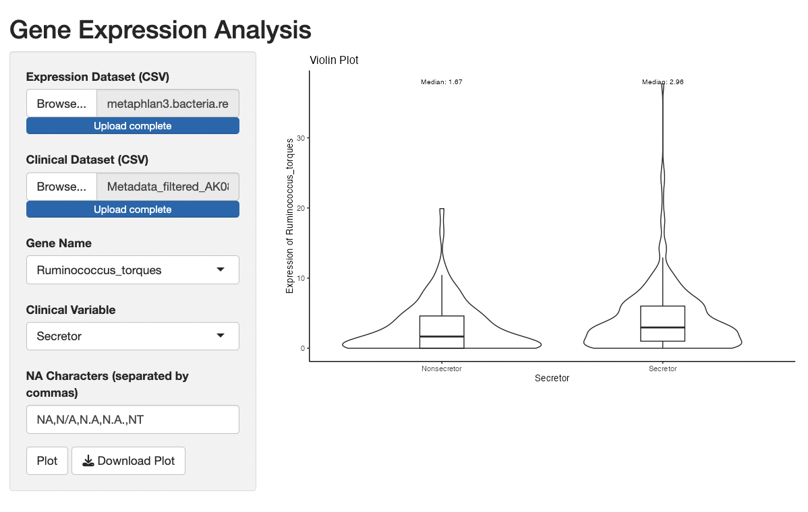
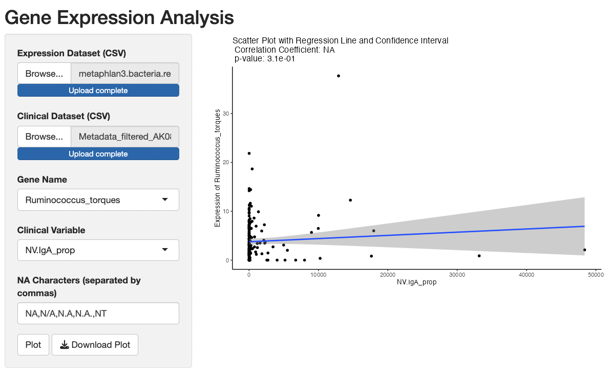

# Gene Expression Analysis Shiny App

The **Gene Expression Analysis Shiny App** is a user-friendly and interactive tool designed for exploring and visualizing gene expression data in association with clinical variables. It allows users to upload their gene expression dataset and clinical dataset in CSV format and then select a specific gene of interest and a clinical variable for analysis. The app supports both categorical and numeric clinical variables, generating either violin plots or scatter plots with regression lines and confidence intervals, respectively.

## Features and Capabilities

### 1. Upload Gene Expression and Clinical Datasets

The app provides a user-friendly interface for uploading gene expression and clinical datasets. Users can upload their data by using the "Expression Dataset (CSV)" and "Clinical Dataset (CSV)" file input widgets.

### 2. Select Gene and Clinical Variable

After successfully uploading the datasets, users can select the gene of interest and the clinical variable from their respective dropdown menus. The gene names are dynamically fetched from the row names (genes) of the expression dataset, making it easier for users to select their desired gene without any manual input.

### 3. Handling Missing Values

The app supports handling missing values in the clinical data by allowing users to specify the characters that represent missing values. Users can enter the characters representing missing values in a text input box labeled "NA Characters (separated by commas)". The app will use these specified characters while reading the datasets to handle missing values appropriately.

### 4. Visualization of Gene Expression Data

The app visualizes the gene expression data in two different ways based on the type of the selected clinical variable:

#### a. Violin Plot (Categorical Clinical Variable)

For categorical clinical variables, the app generates a violin plot, providing an insight into the distribution of gene expression levels across different levels of the clinical variable. It also overlays box plots on the violins, showing additional information about medians and quartiles.

#### b. Scatter Plot with Regression Line (Numeric Clinical Variable)

For numeric clinical variables, the app creates a scatter plot, enabling users to explore the relationship between gene expression levels and the numeric clinical variable. The plot includes a fitted regression line along with confidence intervals, helping to identify trends and correlations.

### 5. Statistical Information

The app includes relevant statistical information to aid interpretation:

#### a. Violin Plot

- Median labels: For the violin plot, the app provides median labels, displaying the median gene expression level for each level of the categorical clinical variable.
 

#### b. Scatter Plot

- Correlation Coefficient: The scatter plot includes the correlation coefficient between the gene expression levels and the numeric clinical variable, indicating the strength and direction of the relationship.
- p-value: The p-value for the correlation coefficient is also displayed, providing a measure of the statistical significance of the correlation.

### 6. Download Plot

The app allows users to download the generated plot as an image file (PNG format) by clicking on the "Download Plot" button. This feature enables users to save and share the visualizations for further analysis or presentation purposes.

## Usage

1. **Upload Datasets**: Start by uploading your gene expression and clinical datasets in CSV format using the "Expression Dataset (CSV)" and "Clinical Dataset (CSV)" file input widgets.

2. **Select Gene and Clinical Variable**: After successful data uploads, select the gene of interest and the clinical variable from their respective dropdown menus.

3. **Specify NA Characters (Optional)**: If your datasets have missing values represented by specific characters, enter those characters (separated by commas) in the "NA Characters" text input box. This step is optional if your datasets do not have missing values.

4. **Plot Gene Expression**: Click on the "Plot" button to generate the desired plot based on the selected gene and clinical variable.

5. **Interact with the Plot**: Explore the generated plot to gain insights into the gene expression patterns and their relationship with the selected clinical variable.

6. **Download Plot (Optional)**: If you wish to save the generated plot, click on the "Download Plot" button. The plot will be downloaded as a PNG file, which you can use for further analysis or presentations.

## Conclusion

The Gene Expression Analysis Shiny App simplifies the visualization and exploration of gene expression data in association with clinical variables. It offers flexibility in handling missing values and provides insightful visualizations that help researchers and analysts gain a deeper understanding of the relationship between gene expression and clinical traits. The ability to download the plots as images makes it easy to share and incorporate the findings into scientific publications and reports.

